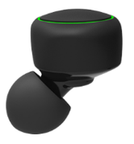
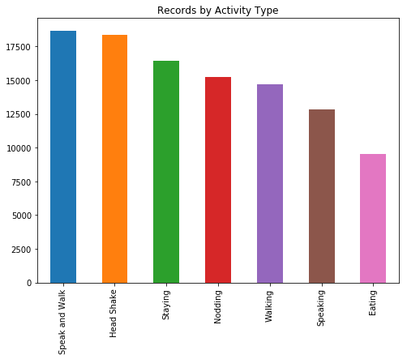
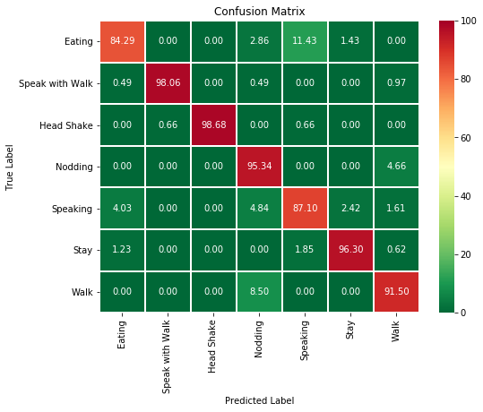
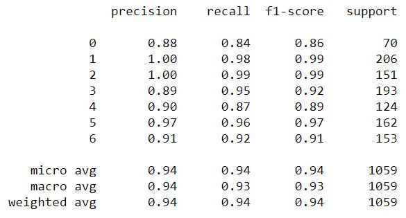

# Human Activity Recognition from eSense datasets

 [eSense](http://www.esense.io/) is an earable device. It has built-in sensors which provides accelerometer and gyroscope data. From this data, human activities are recognized using machine learning algorithm.

# Dataset

  - **eSense device data** : There are 7 types of activities. The data is collected from 6 persons

# Tools

- **Jupyter Notebook**

# 1D CNN Model
```sh
model = Sequential()
model.add(Conv1D(filters=64, kernel_size=3, activation='relu', input_shape=(n_timesteps,n_features)))
model.add(Conv1D(filters=64, kernel_size=3, activation='relu', padding = 'same'))
model.add(Dropout(0.5))
model.add(MaxPooling1D(pool_size=2))
model.add(Flatten())
model.add(Dense(100, activation='relu'))
model.add(Dense(n_outputs, activation='softmax'))
model.compile(loss='categorical_crossentropy', optimizer='adam', metrics=['accuracy'])
    
# fit network
history = model.fit(X_train, y_train, validation_data=(X_test, y_test), 
                    epochs=epochs, batch_size=batch_size, verbose=verbose)
```

# Description
- **Activity Types** for this dataset <br/>


- **Confusion Matrix** using **CNN** for the dataset <br/>


- **Classification Report** for the model <br/>

